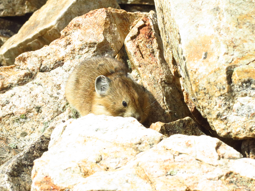

**Some things I like to do:**

Distance running, reading, cooking

**Some books I really liked:**

-   _If On a Winter's Night a Traveller_  by Italo Calvino
-   _Goodbye Columbus_  by Phillip Roth
-   _What is the What_  by Dave Eggers
-   _The Savage Detectives_  by Roberto Bolaño
-   _A Thousand Splendid Suns_ by Khaled Hosseini

  
  
See ["Joshua Tree"](https://issuu.com/wowjournal/docs/journal_2016_final?e=11454900%2F38192403), for an environmental awareness article I wrote for _Words of the Watershed_ journal.

